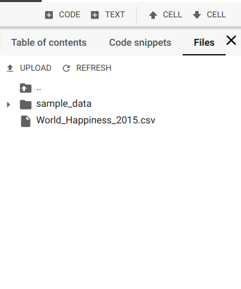
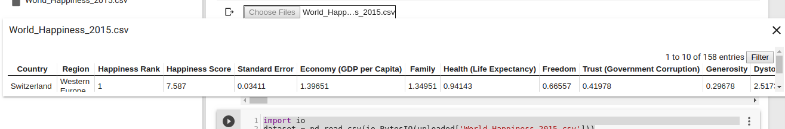
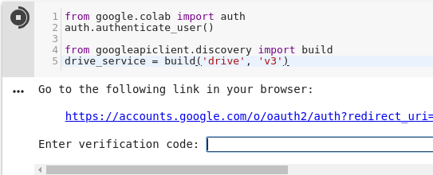

O [Google Colab](https://colab.research.google.com) é uma ferramenta criada pelo Google que permite que qualquer pessoa consiga produzir e rodar desde os notebooks IPython (`.ipynb`) mais simples até treinar um modelo de _deep learning_ mesmo sem possuir uma GPU. É só usar sua conta Google e você terá acesso a 12GB de RAM, GPU/TPU (desde que não abuse e use para ganhar criptomoedas),sendo todo seu trabalho sincronizado no Drive.

Um dos primeiros problemas que aparecem ao usar o Colab é: como carregar arquivos nessa ferramenta, já que ele não tem acesso ao meu HD? Nesse post são listados 5 jeitos de fazer isso, cada um com suas vantagens e desvantagens.

### 1. Usando um link

Basta ver a documentação do método [`read_csv`](https://pandas.pydata.org/pandas-docs/stable/reference/api/pandas.read_csv.html) da biblioteca `pandas` para ver que uma url pode ser usada para carregar seu dataset. O jeito mais fácil de disponibilizar um link é fazendo o upload dos dados para o GitHub, mas nesse caso existe a limitação de que o arquivo deve ter menos de 25MB (um arquivo maior não pode ser mantido em seu repositório).

```python
dataset = pd.read_csv(*link*)
```

Algumas alternativas ao GitHub como [GitLab](https://gitlab.com) e [BitBucket](http://bitbucket.org) possuem um limite mais flexível, o primeiro depende das configurações da sua organização e no segundo caso, o arquivo deve respeitar o limite de tamanho do repositório, que não pode ser maior que 2GB.

### 2. Fazendo upload de sua máquina via código

> Método apresentado no post do Towards Data Science: [3 Ways to load csv into colab](https://towardsdatascience.com/3-ways-to-load-csv-files-into-colab-7c14fcbdcb92)

O Colab possibilita que você insira arquivos do seu computador no notebook através do método `files` do módulo `google.colab`. Ao chamar `files.upload()`, uma caixa de seleção vai aparecer como na imagem abaixo:


Depois de escolher o arquivo, o objeto `uploaded` acima, que é um dicionário com os dados em formato de bytes, pode ser manipulado para virar um objeto tratado pelo `pandas`. Para isso, usamos a biblioteca `io`, como mostrado no exemplo abaixo.

```python
import io
dataset = pd.read_csv(io.BytesIO(uploaded['file.csv']))
```

Apesar de ser prático para um estudo rápido sobre um arquivo pequeno, por exemplo, essa _feature_ pode apresentar incompatibilidade com algumas versões de alguns navegadores, então nem sempre o método é aplicável.

### 3. Fazendo upload de sua máquina via colab

Uma alternativa relativamente recente, oferecida pelo próprio Colab, é usar a seção `Files` do menu lateral.



Ao cliclar no botão **UPLOAD**, uma janela de seleção semelhante à do item anterior será aberta. Depois do upload, o arquivo é listado nessa seção. Com 2 cliques é possível ainda visualizar (e filtrar!) o conteúdo do dataset.



No entanto, a maior mudança em relação ao `google.colab` é que, além de apresentar maior compatibilidade com os navegadores, o arquivo não precisa ser convertido. Dá pra usar `read_csv` passando o nome do arquivo e a extensão.

---

Os dois últimos métodos possuem algumas desvantagens em comum:

- Toda vez que o notebook for aberto, o processo de upload precisa ser repetido ( o que prejudica muito a reproducibilidade do que você fez no notebook);

- Um arquivo grande vai demorar bastante, principalmente se a sua internet não for tão rápida.

Por isso, os dois se tornam mais úteis quando se quer fazer algo rápido e que não precisa ser compartilhado com outras pessoas.

### 4. Google Drive

Ao abrir uma pasta no Google Drive, você pode observar que ela possui um _hash_, um código em sua url. Bem, dá para usar esse link para ler os arquivos dessa pasta.

O primeiro passo é a ~~aceitação~~ autenticação. Ao rodar o código abaixo e clicar no link, você vai recer um _token_ para copiar e colar na caixa que é exibida no notebook.

```python
from google.colab import auth
auth.authenticate_user()

from googleapiclient.discovery import build
drive_service = build('drive', 'v3')
```



Depois de se autenticar, você já pode usar o objeto `drive_service` para consultar os arquivos. Com a API do Google Drive, é possível fazer a consulta especificando um parâmetro do método `files().list()`:

```python
response = drive_service.files().list(q=" '"+folder +"' in parents",
 spaces='drive',
 fields='nextPageToken, files(id, name)').execute()
```

Especificando `'"+folder+"' in parents` são filtrados os arquivos que estão dentro da pasta `folder`.

Depois de recuperados os arquivos, iterar sobre eles, vamos recuperar seus IDs e usar `files().get_media(fileId=id)` para baixar o arquivo através da API. Depois disso, os bytes podem ser traduzidos e o arquivo tratado.

Tudo isso deve ser feito dentro de um loop.

Abaixo, um código completo com o exemplo de arquivos de imagens

```python
page_token = None
  while True:
      response = drive_service.files().list(q="mimeType='image/png' and '"+folder +"' in parents",
                                            spaces='drive',
                                            fields='nextPageToken, files(id, name)',
                                            pageToken=page_token).execute()
      for file in response.get('files', []):
          # Process change
          file_id = file.get('id')
          request = drive_service.files().get_media(fileId=file_id)
          downloaded = io.BytesIO()
          downloader = MediaIoBaseDownload(downloaded, request)
          done = False
          while done is False:
            # _ is a placeholder for a progress object that we ignore.
            # (Our file is small, so we skip reporting progress.)
            _, done = downloader.next_chunk()

          downloaded.seek(0)
          
           if('.csv' in file.get('name')):
                datasets.append(io.BytesIO(downloaded.read()))
          
      page_token1 = response.get('nextPageToken', None)
      if page_token1 is None:
          break
```

Com os arquivos recuperados, para usar o dataset, podemos passar o objeto para `read_csv`, por exemplo:

```python
dataset = pd.read_csv(datasets[0])
```

Com essa alternativa mais complexa, é preciso ter cuidado ao filtrar os arquivos, além de compartilhar toda a pasta com quem precisar reproduzir o estudo feito usando essa técnica.

### 5. Arquivos compactados

O último método é na verdade um caso específico que pode acontecer ao usar qualquer um das opções anteriores.

Alguns tipos de arquivos compactados não são lidos facilmente pelo `pandas`, como os disponilizados pelo IMDb. Para tratá-los, podemos usar a biblioteca `gzip` para descompactar e o método `urllib` do módulo `six.moves` para baixar o dataset. E _voilà_: 

```python
from six.moves import urllib
import gzip

handle = urllib.request.urlopen('https://datasets.imdbws.com/title.basics.tsv.gz') #download
file = gzip.GzipFile(fileobj=handle) #unzip

movies = pd.read_csv(file, sep="\t")
```

## Considerações finais

Cada método tem seu nível de dificuldade e uma limitação quanto ao tamanho da massa de dados que podem ser carregados de forma eficiente, cabe a cada um ver qual se encaixa melhor em cada situação.

Nos links, existe a referência para uma alternativa ao passo 4 e alguns métodos para salvar arquivos a partir do Colab.

Até a próxima!

## Links

[API de busca de arquivos do Google Drive](https://developers.google.com/drive/api/v3/search-parameters)

[Material do próprio Colab que contém maneiras de salvar arquivos](https://colab.research.google.com/notebooks/io.ipynb)
