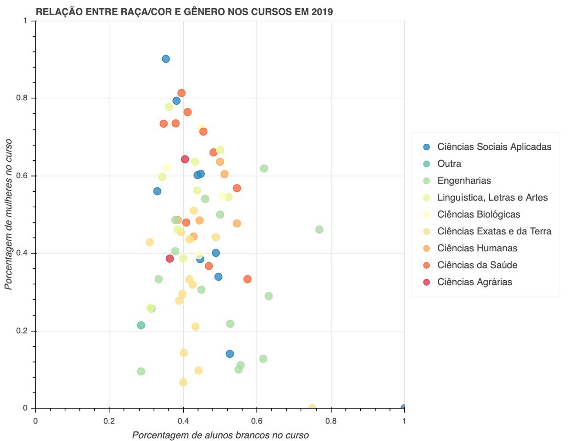

Uma reportagem do Nexo Jornal analisando a [distribuição de gênero e raça de estudante do ensino superior no Brasil](https://www.nexojornal.com.br/grafico/2017/12/13/Gênero-e-raça-de-estudantes-do-ensino-superior-no-Brasil-por-curso-e-área), realizada com os dados de 2016, serviu de inspiração para um estudo local utilizando [dados abertos da UFRN](http:/dados.ufrn.br).

Uma parte da análise resume-se a identificar os padrões de estudantes com base nas áreas de conhecimento.  Os demais estudos podem ser encontrados no repo

## Como está a UFRN hoje?

O primeiro passo foi conferir o cenário atual (2019), com foco em ver quais áreas possuem maior proporção de alunas, tentando responder a seguinte pergunta: 

No que diz respeito à presença feminina, os cursos de ciências da saúde e ciências sociais aplicadas são os que possuem mais de metade dos matriculados do sexo feminino. Desses, o que se encontra no topo é Serviço Social, tendo mulheres compondo 90% do total de estudantes.

No curso de tecnologia da Informação, 9,74% dos alunos ingressantes eram mulheres.

Como esperado, boa parte dos cursos de engenharia e de ciências exatas possuem menos de 50% de ingressantes do sexo feminino, o que pode ser constatado ao observar os pontos verde-claros e amarelos na metade inferior do gráfico abaixo:

Além disso, boa parte dos cursos que possuem mais de 50% de alunos brancos (metade direita do gráfico) também são da área de engenharias.

Em relação aos estudantes negros, o curso em que possuem a presença mais significativa é Teatro, onde foram 23% dos ingressantes. Em seguida, Música e Dança, respectivamente, foram os que mais receberam alunos negros em 2019.

Em TI, estudantes negros foram 6.3% dos matriculados neste ano.

## O que mudou ao longo do tempo?

