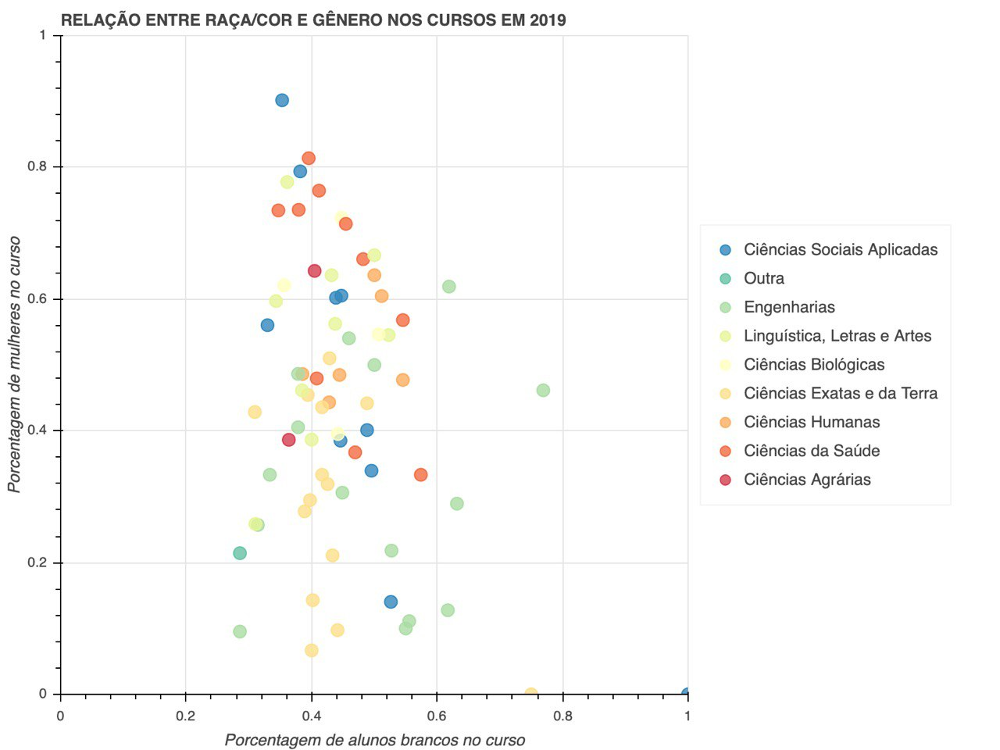
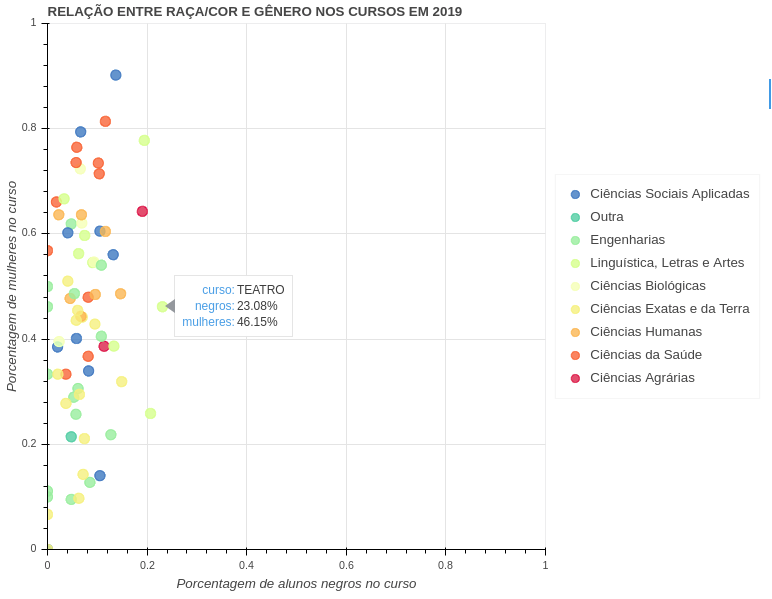
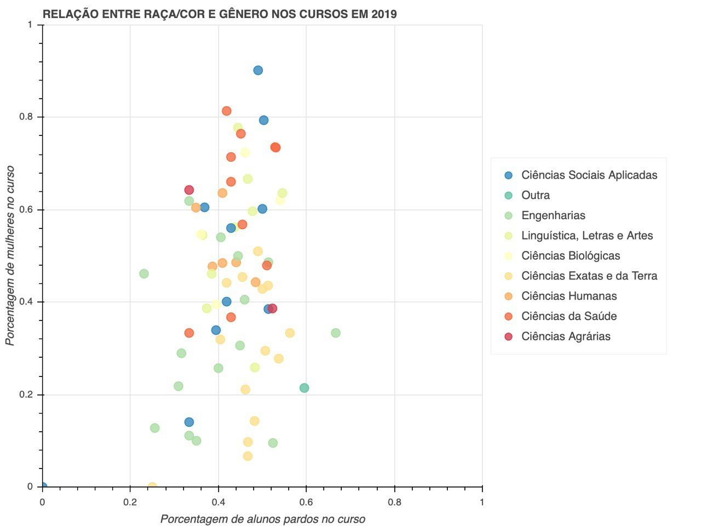
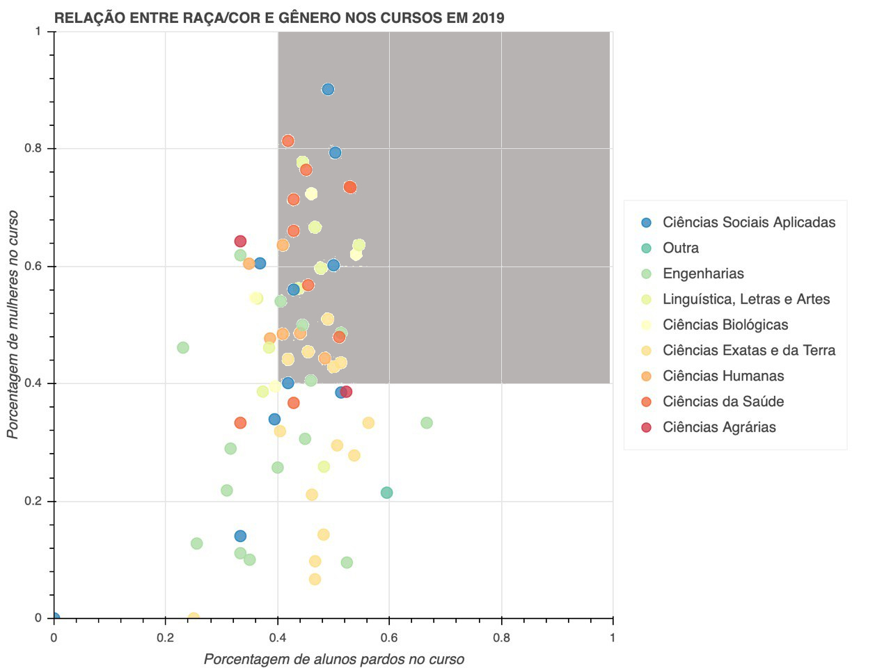
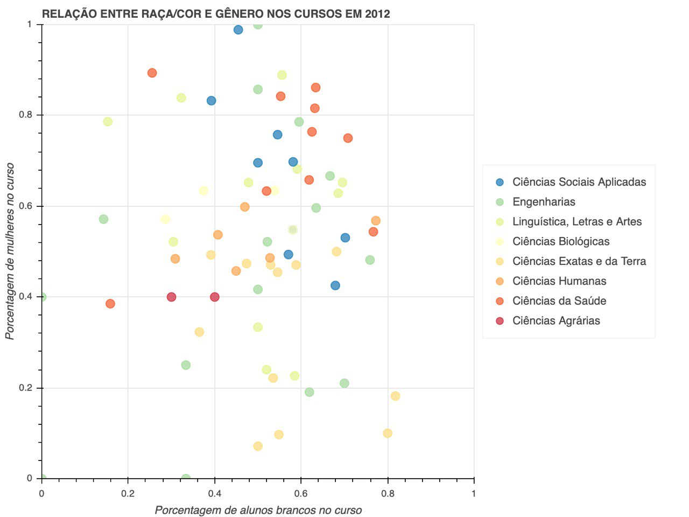
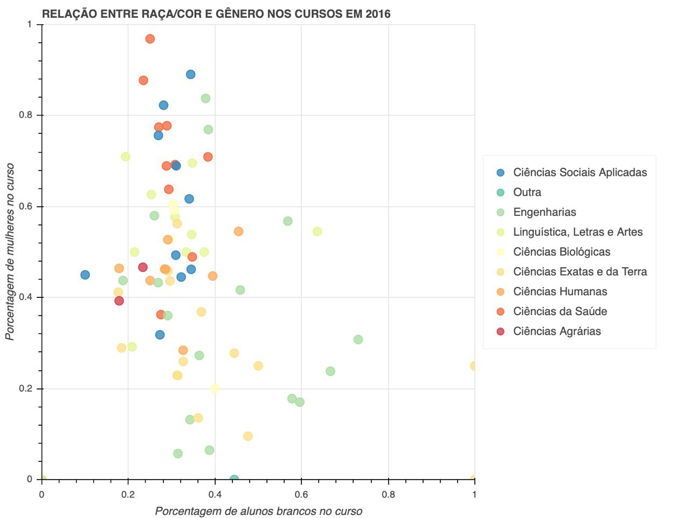
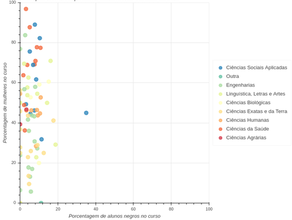
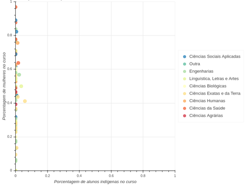

Baseando-se em uma reportagem do Nexo Jornal que analisou a [distribuição de gênero e raça de estudantes do ensino superior no Brasil](https://www.nexojornal.com.br/grafico/2017/12/13/Gênero-e-raça-de-estudantes-do-ensino-superior-no-Brasil-por-curso-e-área), realizada com os dados de 2016 do INEP, foi feito um estudo local utilizando [dados abertos da UFRN](http:/dados.ufrn.br).

Uma parte da análise resume-se a identificar os padrões de estudantes com base nas áreas de conhecimento. Uma das bases usadas é a de discentes, que contém os dados do status (ativo, concluído, trancado) do curso do estudante, id do curso em que ele está matriculado, a matricula, a raça e o sexo.

O outro dataset é o de cursos, que contém o nome do curso, a modalidade (graduação, doutorado, técnico) e a área de conhecimento na qual o curso se encaixa. 

Para visualizar os gráficos interativos, acesse [este link](https://nbviewer.jupyter.org/github/nymarya/gender-and-race-ufrn/blob/master/genero_e_raca_todos.ipynb#Finalmente,-é-hora-de-juntar-tudo-e-plotar!). Lá, ao passar o mouse por cada ponto é possível visualizar o nome do curso, bem como a taxa de alunas mulheres e de alunos da raça determinada no gráfico. Também é possível usar o slider para mudar o ano analisado.

Os demais estudos podem ser encontrados no [repositório](https://github.com/nymarya/gender-and-race-ufrn).

## Como está a UFRN hoje?

O primeiro passo foi conferir o cenário atual (2019), com foco em ver quais áreas possuem maior proporção de alunas e de alunos de diferentes raças, além de atentar-se também a essas informações em relação ao curso de Tecnologia da Informação (BTI).

No que diz respeito à presença feminina, os cursos de ciências da saúde e ciências sociais aplicadas são os que possuem mais de metade dos matriculados do sexo feminino. Desses, o que se encontra no topo é Serviço Social, tendo mulheres compondo 90% do total de estudantes.

No curso de tecnologia da Informação, 9.74% dos alunos ingressantes eram mulheres.

Como esperado, boa parte dos cursos de engenharia e de ciências exatas possuem menos de 50% de ingressantes do sexo feminino, o que pode ser constatado ao observar os pontos verde-claros e amarelos na metade inferior do gráfico abaixo:

Além disso, boa parte dos cursos que possuem mais de 50% de alunos brancos (metade direita do gráfico) também são da área de engenharias.

Em relação aos estudantes negros, o curso em que eles possuem a presença mais significativa é Teatro, onde foram 23% dos ingressantes. Em seguida, Música e Dança, respectivamente, foram os que mais receberam alunos negros em 2019. Também é interessante notar que esses cursos, bem como a maioria dos que tem apresentam uma presença de ingressantes negro superior a 10%, também possuem mais de 40% de mulheres.

No BTI, estudantes negros foram 6.3% dos matriculados neste ano.

Ao analisar os ingressantes de 2019 que se declaram como pardos, vemos que, dos (poucos) cursos nos quais esses alunos são pelo menos 50%, uma parte considerável são das áreas de ciências sociais aplicadas e ciências exatas e da terra.

Uma observação interessante é a de que boa parte dos cursos nos quais ao menos 40% dos ingressantes eram mulheres também é vista uma presença considerável de pessoas de raças diferentes da branca. A relação onde essa percepção é mais evidente é a que compara a porcentagem de mulheres com a de alunos pardos, sendo ciências da saúde, ciências humanas e ciências sociais aplicadas as áreas onde esse comportamento é mais facilmente encontrado. Essa interseção de informações foi destacada na área cinza do gráfico abaixo:

## O que mudou?

Em 2012, pelos menos 40% dos alunos ingressante de muitos cursos se declaravam brancos. E isso acontecia em todas as áres de conhecimento, com exceção de ciências agrárias. Além disso, as alunas mulheres eram menos de um terço basicamente em algumas engenharias e cursos de ciências exatas e da terra. Em todos os cursos de exatas, mulheres são menos de 50% dos alunos matriculados. 

Já em 2016, pouco cursos possuíam mais de 40% de alunos brancos sendo matriculados, o que é bem contrastante com a situação de 2012. O que não supreende, porém, é que nesse grupo seleto os cursos de engenharia e ciências exatas se mostram mais presentes, comparando a outras áreas. O cenário em que engenharia e exatas são as áreas onde a proporção de mulheres é menor também não mudou muito, levando-se em consideração que neste momento possuem ainda menos alunas.

No ano de 2019, a distribuição de alunos brancos muda novamente, assumindo um padrão mais parecido com 2012, apesar de agora serem observados bem menos cursos com alunos brancos sendo 60% dos estudantes ingressantes.

Tanto em 2019 como em 2016, apenas um curso de exatas possui uma turma de ingressantes com proporção de 50% ou mais de mulheres.

No curso de Tecnologia da Informação, cujos dados não existem em 2012 devido à data de criação do curso, a proporção de mulheres ingressantes varia entre 9% e 15% ao longo dos anos, com a taxa de 9.74% em 2019, como citado anteriormente.

## Como estamos em relação ao Brasil?

Para poder comparar com os resultados encontrados pelo Nexo Jornal, foram analisados os dados de alunos que ingressaram em 2016 e estão com status de "ativo" ou "concluído".

O fato de os cursos de engenharias e exatas apresentarem poucos negros e poucas mulheres, por exemplo, estão de acordo com a situação observada no cenário nacional. No entanto, algo que chama a atenção é a presença considerável de negros em Gestão de Cooperativas.

Enquanto na UFRN os cursos com mais alunos ingressantes indígenas são Ciências Autuariais, Dança e Engenharia Ambiental, no gráfico do Nexo não são destacados cursos das mesmas áreas. Apesar dessa diferença, a falta de indígenas na UFRN parece assumir a mesma proporção do cenário no restante do Brasil. 

## Considerações finais

Apesar de alguns avanços em relação à presença de alunas mulheres na UFRN, a falta de diversidade no que diz respeito a raça ainda é alarmante, principalmente pelo fato de o número de cursos com proporção maior de alunos brancos ter aumentado nos últimos anos, atingindo taxas próximas à época antes do sistema de cota ser implantado.

Isso evidencia a importância de movimentos e comunidades como PyLadies, [Women in Engineering](https://www.instagram.com/wie.ufrn/?hl=pt-br), [Women Tech Makers](https://www.instagram.com/wtmnatal/) e [AfroPython](https://afropython.org) em Natal, bem como outros que possam atrair pessoas ainda mais diversas para a UFRN, como aqueles de origem oriental e indígenas.

Até a próxima!

