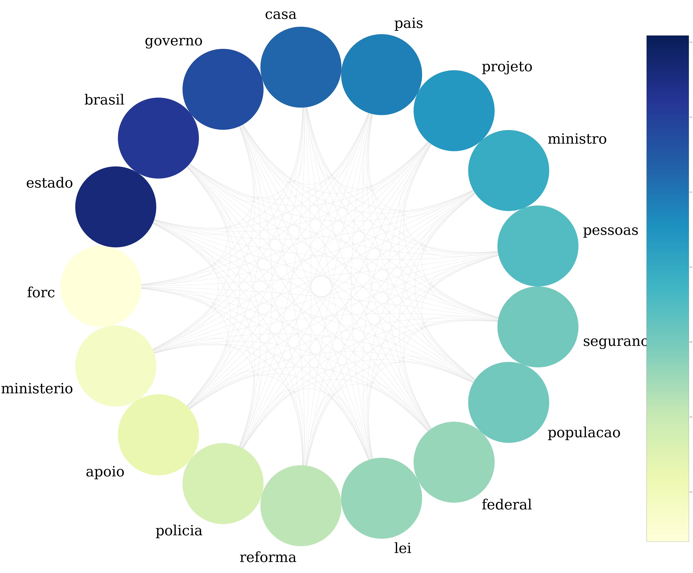

Vivemos numa época em que é necessário prestar mais atenção ao que os políticos estão fazendo. Uma forma de se manter atualizado é monitorar o que eles dizem em seu dizem no congresso.

Para a nossa sorte, a [API  da câmara de deputados](https://dadosabertos.camara.leg.br/swagger/api.html) disponibiliza discursos dos deputados. Para usar esses textos,  
podemos usar a teoria de grafos, conforme [este artigo](https://towardsdatascience.com/measuring-discourse-bias-using-text-network-analysis-9f251be5f6f3) sobre análise de redes a fim de medir 
viés em discursos.

O código utilizado para esta análise pode ser encontrado neste [repositório](https://github.com/nymarya/political-speeches-networks).

## Dos dados aos grafos

Tudo se inicia importação dos dados. Com o auxílio da biblioteca [requests](https://pypi.org/project/requests/) do Python, podemos consultar os discursos de cada deputados
através da url `deputados\{id}\discursos`. Os ids dos deputados, bem como o partido e  foram recuperados consultando a url `deputados`. Para definir um limite de 
discursos utilizados, filtramos apenas os que aconteceram este ano adicionando os parâmetros `dataInicio=2019-01-01` e  
`dataFim=2019-06-11`. Finalmente, ordenamos pelo horário de início do discurso. No fim, teremos uma consulta assim:

```
 query = 'https://dadosabertos.camara.leg.br/api/v2/deputados/'+str(dep[0])+\
           '/discursos?dataInicio=2019-01-01&dataFim=2019-06-11&ordenarPor=dataHoraInicio&ordem=ASC'
```

O retorno desta consulta é um json que contém a chave `transcricao`. Seu valor é justamente o discurso em si.

```python
 speeches = []
 
 total = len(deputies)
 # Create a dictionary that contains
 # id, speech, party, state
 for i, dep in enumerate(deputies):
   
   # Get all speechs given by the current deputy
   query = 'https://dadosabertos.camara.leg.br/api/v2/deputados/'+str(dep[0])+\
           '/discursos?dataInicio=2019-01-01&dataFim=2019-06-11&ordenarPor=dataHoraInicio&ordem=ASC'
   response = requests.get(query)
   speech_json = response.json()
   
   # Add each speech to the list
   speeches += [[ dep[0], speech['transcricao'], dep[1], dep[2] ] for speech in speech_json['dados']]
```

Com isso, podemos montar um dataset que terá informações como id do deputado, discurso, sigla do partido e sigla do estado.

Criado o dataset, é hora de tratar os dados. A característica mais importante a ser notada nos discursos, é a de que todos tem 
uma introdução do locutor, como nos exemplos abaixo:

> O SR. ABOU ANNI (PSL - SP. Sem revisão do orador.) -

> DISCURSO NA ÍNTEGRA ENCAMINHADO PELO SR. DEPUTADO BILAC PINTO.\r\n\r\n

Para remover esses textos que não trazem relevância para o estudo, usamos algumas funções do `pandas`. Para o primeiro caso, 
a string é dividida pelo símbolo "-" duas vezes, sendo as duas primeiras substrings obtida ignoradas. Esse processo apaga as
strings que não seguem o primeiro padrão, sendo então necessário aplicar o tratamento do segundo padrão em uma cópia do dataset 
e unindo ambos ao final. O segundo tipo de introdução é removida ao dividir a string quando encontrar "\r\n\r\n" e manter 
apenas a segunda substring. Ao final, ainda é necessário remover todas as ocorrências de "\r", "\n" e "-" para a próxima 
etapa do desenvolvimento.

A formação dos grafos se dá através do mapeamento das palavras usadas no discurso, sendo a frequência em que elas aparecem no 
texto o atributo que usaremos para medir sua importância. Cada nó é uma palavra e uma aresta 
entre duas palavras indica que elas aparecem no mesmo contexto.

O que é contexto para nós? Bem, dada uma frase, cada palavra que a compõe é agrupada com suas vizinhas em grupos de 2 e 5 
palavras. Por exemplo, a frase 

 > Olhos de cigana oblíqua e dissimulada
  
seria dividida em

> [Olhos de ], [de cigana], [cigana oblíqua], [oblíqua e], [e dissimulada], [ Olhos de cigana oblíqua e ], [de cigana oblíqua e dissimulada]

Esse método é o mesmo explicado no artigo mencionado na seção anterior e isso que tratamos como o contexto de uma palavra.

Depois de divididas, são contadas quantas vezes cada conjunto ocorre no texto. Para isso, usamos a classe 
[CountVectorizer](https://scikit-learn.org/stable/modules/generated/sklearn.feature_extraction.text.CountVectorizer.html#sklearn.feature_extraction.text.CountVectorizer) do 
`scikit-learn`, que recebe uma expressão regular na forma `['[A-Za-z]+(?=\\s+)']` para recuperar todas as palavras além dos espaços 
em branco que a seguem. Ao receber o parâmetro `ngram_range=(2,5)`, a própria função gera todas as combinações de palavras vizinhas 
de tamanho de 2 a 5 (sendo as de tamanho 3 e 4 removidas para formar o grafo nos próximos passos). 

Um parâmetro essencial que deve ser passado é o `stop_words`, que define quais palavras devem ser ignoradas neste processo. 
Conjunções e artigos, por exemplo, são elementos que se repetem muito na língua portuguesa, o que traria uma frequência muito alta para estas palavras que 
não tem significado ao serem analisadas sozinhas. Sendo assim, muitos verbos, saudações, advérbios e outros elementos são adicionados 
nesta lista e não se tornam nós de um grafo.

A classe é instânciada como abaixo:
```python
vec_alphanumeric = CountVectorizer(token_pattern=TOKENS_ALPHANUMERIC,decode_error='replace' ,
                                   stop_words=STOP_WORDS, ngram_range=(2,5),
                                   encoding='latin1', strip_accents='unicode')
```
 e ao acessar `vec_alphanumeric.vocabulary_` temos acesso a um dicionário no qual cada chave é um conjunto de palavras e 
 o seu valor representa o número de ocorrências no texto.
 
 O grafo é gerado usando a biblioteca [NetworkX](). O método responsável por sua criação recebe um par (chave, valor) do 
 dicionário criado pelo CountVectorizer e da chave extrai todas as palavras, 
 criando um nó para cada. Depois, forma pares dessas palavras e cria uma aresta para cada par com o peso sendo o valor recebido na entrada. 
 Se a aresta já existir, seu  peso é somado à frequência da frase. 
 
 ```python
 def generate_graph(vocabulary):
   
   # Create a undirected graph
   G = nx.Graph()
   
   # Iterate over each item of the vocabulary
   for phrase, frequency in vocabulary.items():
     # Get words in the phrase
     words = phrase.split()
     
     # Using only tokens of length 2 or 5
     if len(words) not in [2,5]:
       continue
     
     words_norm = [norm(word) for word in words if is_important(word) ]
     # Extract unique words in the phrase
     words_unique = list(set(words_norm))
     
     # Create a node if it does not exists already
     G.add_nodes_from(words_unique)
     
     # Form combinations of 2 from the words
     # which will be a edge
     pair = combinations(words_unique, 2) 
     
     for word1, word2 in pair:
       edge = (word1, word2)
       # Increments weight of edge
       # if it already exists
       # Otherwise, create a new edge
       if edge in G.edges:
         G.edges[word1, word2]['weight'] += frequency
       else:
         G.add_weighted_edges_from([(word1, word2, frequency)])
 
   return G
```

A função `norm` é usada para evitar repetiões causadas por palavras no plural ou algumas conjugações de verbos.

Com isso, obtemos nossos lindos grafos que serão analisados na próxima seção.

## Ligando os pontos

Neste estudo, são usados todos os discursos de deputados do mesmo partido. Os partidos gerados são PSL, PT, PDT e NOVO.

Os conceitos utilizados para extrais informações são os de cliques e centralidade. Uma clique nada mais é do que um subconjunto 
de nós que são totalmente conectados entre si. É um conceito geralmente usado para representar um grupo (de pessoas) no qual 
todas se conhecem, que aqui usamos para detectar um grupo de palavras que aparecem no mesmo contexto.

### PSL

A clique que obtemos com o grafo gerado com discursos de deputados do PSL comprova a intuição que temos 
ao pensar nesse partido. Segurança e polícia, que são temas que associamos às promessas dos 
candidatos, estão presentes.



Uma pauta recorrente no congresso e cuja aparição era esperada é a 
reforma da previdência, que pode justificar o nó "reforma" neste grafo.

### PT

Já analisando o discurso do PT, na maior clique aparecem termos como educação, direito, social
que são diretamente ligada às principais pautas do partido.


É esperado também a presença de "defesa", visto que "em defesa da educação" é uma frase frequentemente 
usada para falar das greves e protestos contra os ~~cortes~~ contigenciamentos das verbas para 
a educação. Isso também pode justificar a presença da palavra "ministro".

O tema de reforma da previdência também aparece neste grafo, o que não surpreende dada a posição 
forte do partido contra a mesma.

### NOVO


### PDT


## Considerações finais

## Links

[Curso do Datacamp sobre análise de redes](https://www.datacamp.com/courses/network-analysis-in-python-part-1)
Até a próxima!
